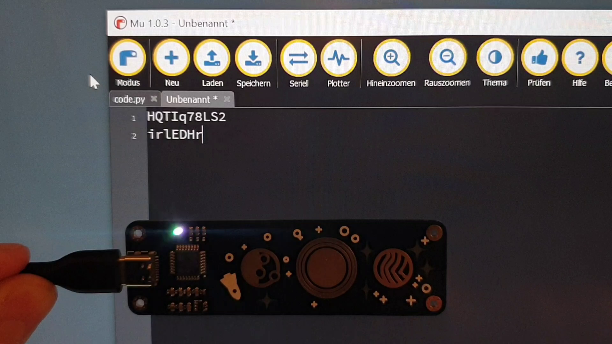

# picoplanet_pwgen

My first experiment with the nice PicoPlanets (https://github.com/bleeptrack/picoplanet): a simple password generator using the raw values from the touch buttons. (But don't rely on the algorithm! ;-) )

